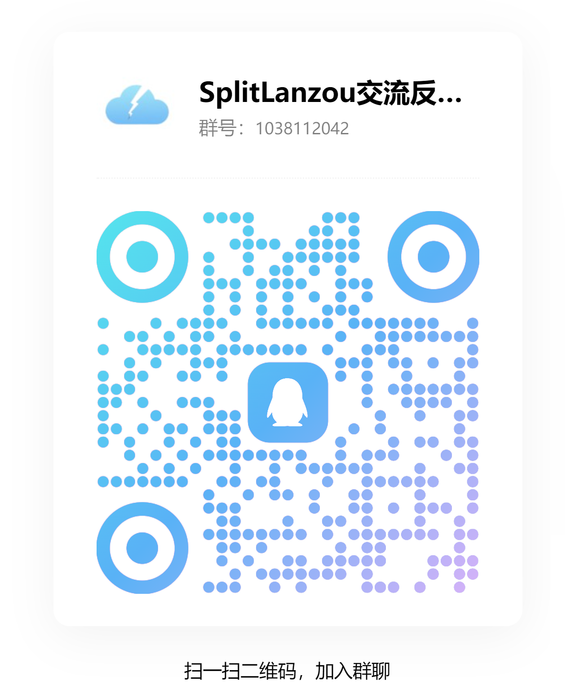
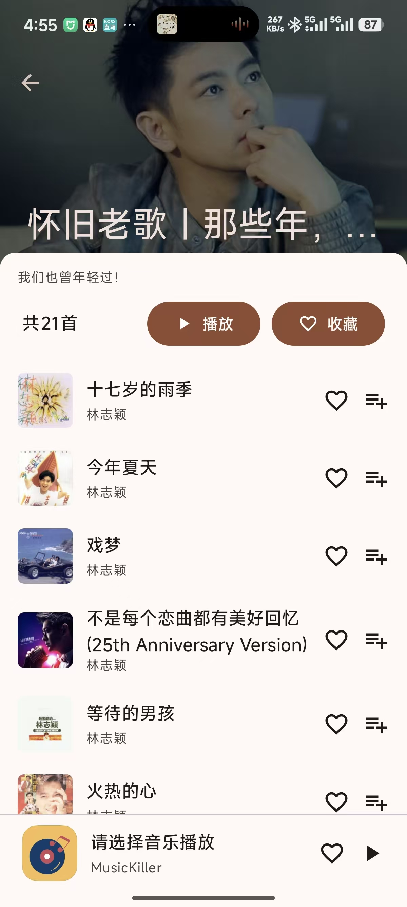
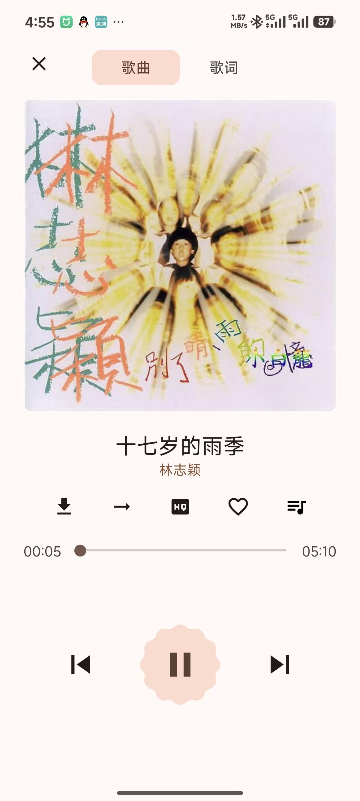
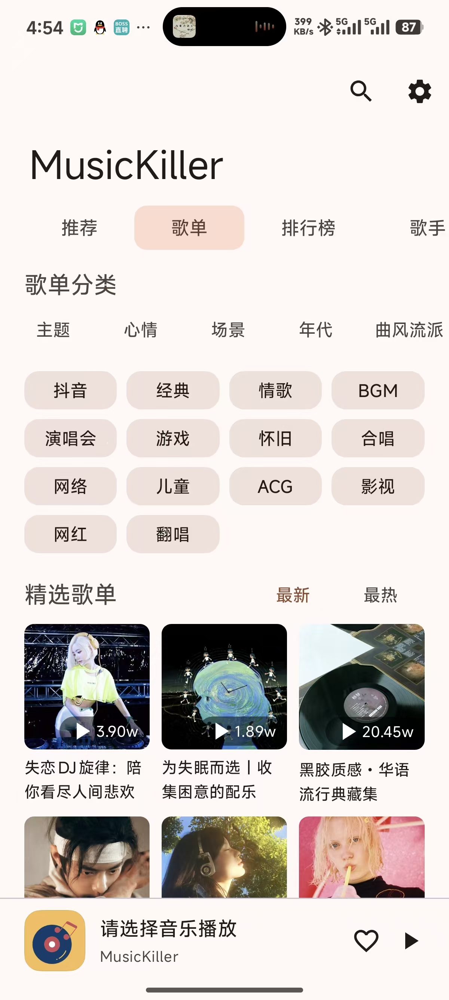
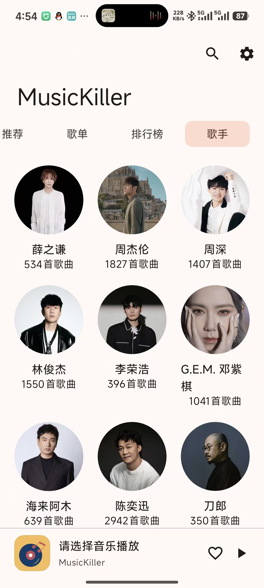

# 🎵 Music Killer

一个简单好用的安卓音乐播放器。

## 下载

[点我去下载](https://gitee.com/jdy2002/MusicKiller/releases)

## 交流/反馈

- QQ 群

- 公众号

## 注意

- 只能用于学习用途
- 不会自动更新，请点击 `Star` 后关注最新版本发布

## 技术栈

- Kotlin
- Java

## 构建

需要自行修改签名 `/app/build.gradle` 修改签名路径和账号密码

## 截图

<img src="./screenshots/微信图片_20251223165550_211_317.jpg" alt="alt text" style="width: 280px"

## 功能

- **播放音乐** - 高质量播放，支持歌词显示
- **搜索** - 搜索音乐、艺术家、专辑、歌单
- **下载** - 下载音乐到本地，支持离线播放
- **收藏** - 收藏喜欢的音乐和歌单
- **排行榜** - 浏览各类音乐排行
- **现代设计** - Material Design 3 风格，支持深色模式

## 系统要求

- Android 7.0 及以上
- 网络连接

## 怎么用

### 搜索和播放

在搜索框输入歌名或艺术家名，点击结果就能播放。

### 下载音乐

在播放界面点击下载按钮，音乐会保存到本地，之后可以离线听。

### 收藏

点击心形图标收藏喜欢的音乐，在收藏页面可以随时找到。

### 排行榜

想发现新音乐？看看排行榜就行。

## 常见问题

**搜不到某些音乐？**
可能是网络问题或者那首歌暂时不可用，试试重新搜索。

**下载的音乐在哪？**
在下载页面可以看到所有下载的音乐。

**能后台播放吗？**
可以的，锁屏后也能继续听。

## 反馈

有问题或建议？

- Gitee: [https://gitee.com/jdy2002/music-killer](https://gitee.com/jdy2002/music-killer)
- GitHub: [https://github.com/yu2002s/music-killer](https://github.com/yu2002s/music-killer)
- 网站: [https://www.jdynb.xyz](https://www.jdynb.xyz)

## 关于

开发者：冬日暖雨 (yu2002s)
邮箱：jiangdongyu54@gmail.com
